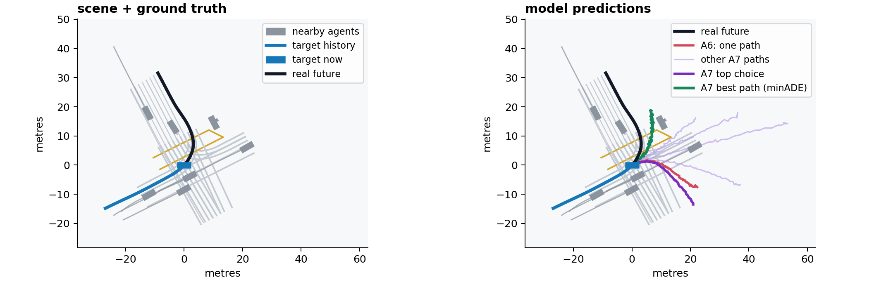
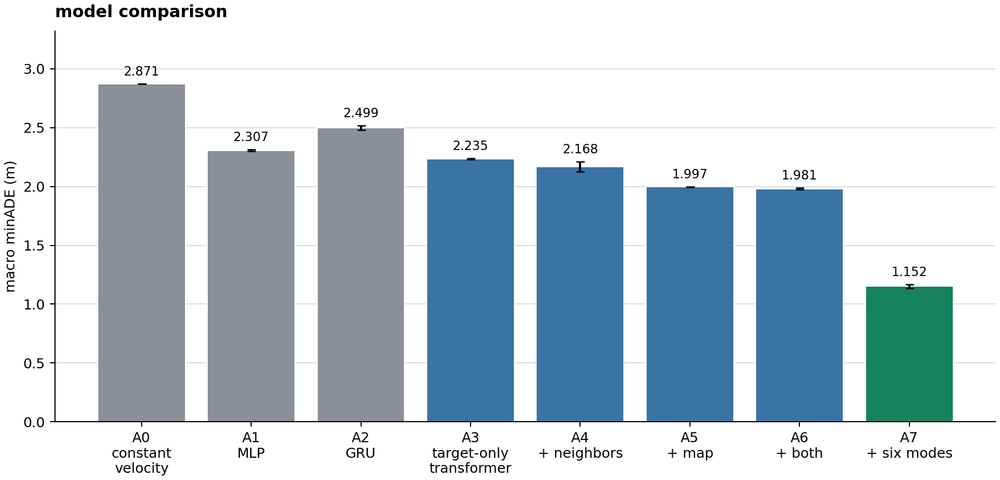
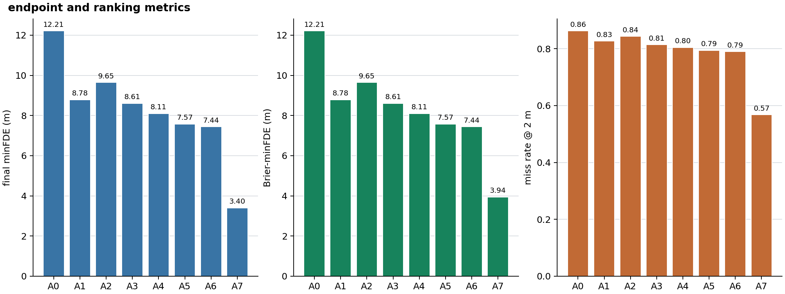
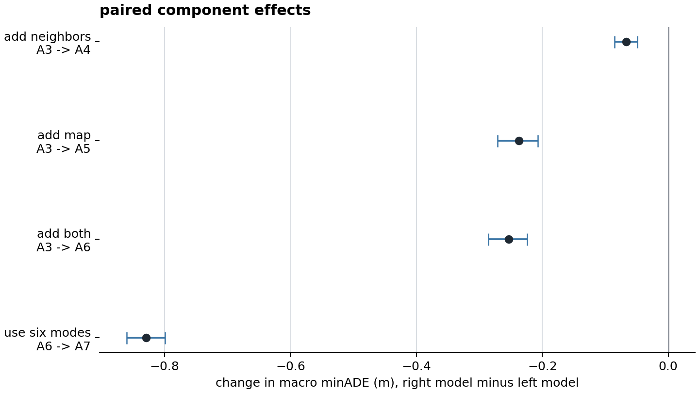

# trajectory prediction for autonomous driving

## what this is

i did this project to study motion prediction in autonomous-driving scenes. the goal is to predict where a vehicle, pedestrian, or cyclist might move next.

the model sees 5 seconds of one road user's movement, then predicts its possible paths over the next 6 seconds. i test whether nearby agents and road-map data help compared with using the target's movement alone.

this uses the public [Argoverse 2 motion forecasting dataset](https://argoverse.github.io/user-guide/tasks/motion_forecasting.html). it uses tracked positions and vector maps, not camera images or anything. each target is predicted on its own.

## what the numbers mean

ADE is just how far the prediction was from what actually happened. lower is better. minADE picks the closest path if the model gives more than one. macro minADE gives the three road-user types the same weight.

A7 gives 6 paths instead of 1. minFDE checks the end of the closest path. Brier-minFDE also checks if the model actually put the good path near the top. the other models only have one path, so that number is the same as minFDE for them.

the `mean +/- std` numbers come from 3 runs. the intervals below compare the same scenes between two models.

## setup

i used 60,000 AV2 scenarios. 50,000 were used for training and 10,000 were kept for checking the models. no scenario appears in both groups.

the models trained for up to 8 epochs with seeds 17, 29, and 43 on an RTX 3070. the full set had 55,053 vehicles, 3,814 pedestrians, and 1,133 cyclists. the dev set had 9,158 vehicles, 669 pedestrians, and 173 cyclists.

A3 to A7 use the same transformer with the same number of parameters. the only changes are which inputs it can use and how many paths it predicts.

| ID | Model | Nearby agents | Map | Modes |
|---|---|---:|---:|---:|
| A0 | constant velocity | no | no | 1 |
| A1 | MLP | no | no | 1 |
| A2 | GRU | no | no | 1 |
| A3 | transformer | no | no | 1 |
| A4 | transformer | yes | no | 1 |
| A5 | transformer | no | yes | 1 |
| A6 | transformer | yes | yes | 1 |
| A7 | transformer | yes | yes | 6 |

## what a trajectory looks like

this is one real scene from the 10,000-scene dev set. i picked a turning, interactive scene where the 6-path model helped, so the difference is easy to see.

the gray lines are the road map. the blue line is the target's past movement, and the boxes are agents at the current time.

the left side shows the real future. the right side compares it with the one-path model and all 6 paths from A7. the green path is the one used by minADE because it ended up closest to the real future. the model does not know which path is best when it makes the prediction.



## data size

the first pilot only used 2,500 scenarios. this final run uses 60,000, which is 24 times more data.

this is enough for this project, but it is still not the full AV2 benchmark. AV2 has about 250,000 motion-forecasting scenarios in total. i also did not use the official validation split here. the 10,000 dev scenes came from the training split and were kept separate by scenario.

## results



| ID | Macro minADE at 6 s (m) |
|---|---:|
| A0 | 2.8714 |
| A1 | 2.3068 +/- 0.0058 |
| A2 | 2.4991 +/- 0.0177 |
| A3 | 2.2349 +/- 0.0056 |
| A4 | 2.1678 +/- 0.0418 |
| A5 | 1.9974 +/- 0.0025 |
| A6 | 1.9813 +/- 0.0092 |
| A7 | **1.1517 +/- 0.0170** |

macro minADE is the main result, so the paired confidence intervals are below. the next figure has the endpoint results from the same 10,000-scene dev set. the full table has the averages and spreads across seeds.



for A0 to A6, Brier-minFDE is exactly minFDE because they only predict one path. it adds new information for A7: its final minFDE is 3.404 m, while Brier-minFDE is 3.943 m because the model did not always score the best endpoint most highly.



the A6 to A7 row is different from the others. A7 gets 6 guesses and minADE picks the closest one after seeing what really happened. so it only says the 6 paths cover more possible futures. it does not mean A7 knew which path would happen.

| Change | Difference in macro minADE | Paired 95% interval | Result |
|---|---:|---:|---|
| A3 to A4: add neighbors | -0.0671 | [-0.0856, -0.0492] | better |
| A3 to A5: add map | -0.2374 | [-0.2709, -0.2070] | better |
| A3 to A6: add both | -0.2536 | [-0.2855, -0.2241] | better |
| A6 to A7: use six modes | -0.8296 | [-0.8607, -0.7996] | more coverage |

## what i found

the map helped more than nearby agents. both together beat the target-only transformer by 0.2536 m.

A7 has 6 guesses, so of course its best guess gets a lower minADE: **1.152 m** vs **1.981 m** for A6. that is just coverage. its first choice was worse, 3.391 m vs 2.910 m, so it was not actually better at choosing what would happen.

this is only my 60k split, not the official AV2 benchmark. [full results](experiments/av2_ablation_60k/final/aggregate.md)

## run it

use Python 3.10 or newer. an NVIDIA GPU is recommended. run these commands from the project folder:

```powershell
python -m pip install -e ".[dev]"
python -m motion_prediction download-av2 --split train --max-scenarios 60000
python -m motion_prediction preprocess-av2 --input data/raw/av2/train --split train --output-dir data/processed/av2_60k --shard-size 1024 --max-scenarios 60000
python -m motion_prediction run-ablation --config configs/av2_ablation_60k.yaml --stage final
python scripts/plot_results.py
python scripts/plot_trajectory_example.py
python -m pytest -q
```

the downloader gets the data from the public AV2 bucket. it skips files that are already there. results, settings, checkpoints, predictions, and metrics go in `experiments/av2_ablation_60k/final`.

the finished run used at most 0.361 GB of PyTorch CUDA memory.

## 60k run files

the run is done. see the [run status](experiments/av2_ablation_60k/progress.md) or [full results](experiments/av2_ablation_60k/final/aggregate.md).
